# 📱 App Convert Systems - React Native

> **Aplicación móvil multiplataforma** desarrollada con React Native y Expo Router para la gestión de productos digitales, autenticación avanzada y comunicación en tiempo real.

## 📊 Arquitectura del Sistema

```mermaid
graph TB
    subgraph app_layer ["🎯 App Layer"]
        A[App/_layout.tsx] --> B[Providers Stack]
        B --> C[SafeAreaProvider]
        B --> D[AuthProvider]
        B --> E[SocketProvider]
        B --> F[ThemeProvider]
    end

    subgraph main_pages ["🏠 Main Pages"]
        G[index.tsx - Home]
        H[gratis.tsx - Free Products]
        I[ofertas.tsx - Offers]
        J[pago.tsx - Payments]
        K[sign-in-form.tsx - Login]
        L[sing-up-form.tsx - Register]
    end

    subgraph contexts ["🔧 Contexts"]
        D --> M[AuthContext - Session Management]
        E --> N[SocketContext - Real-time Communication]
    end

    subgraph custom_hooks ["🎣 Custom Hooks"]
        O[useAuthActions - Login/Logout]
        P[register.hook - Registration]
        Q[datosApi.hook - API Calls]
        R[useSocketNotifications - Socket Events]
    end

    subgraph core_services ["⚡ Core Services"]
        S[apiClient - HTTP Client]
        T[AsyncStorage - Persistence]
        U[Socket.io - WebSocket]
    end

    A --> G
    A --> H
    A --> I
    A --> J
    A --> K
    A --> L

    M --> O
    M --> T
    N --> R
    N --> U
    O --> S
    P --> S
    Q --> S

    %% App Layer styling
    style A fill:#e6f3ff,stroke:#0066ff,stroke-width:2px,color:#000000
    style B fill:#f0f8ff,stroke:#4169e1,stroke-width:2px,color:#000000
    style C fill:#f0f8ff,stroke:#4169e1,stroke-width:2px,color:#000000
    style D fill:#f0f8ff,stroke:#4169e1,stroke-width:2px,color:#000000
    style E fill:#f0f8ff,stroke:#4169e1,stroke-width:2px,color:#000000
    style F fill:#f0f8ff,stroke:#4169e1,stroke-width:2px,color:#000000

    %% Main Pages styling
    style G fill:#e6ffe6,stroke:#00cc00,stroke-width:2px,color:#000000
    style H fill:#e6ffe6,stroke:#00cc00,stroke-width:2px,color:#000000
    style I fill:#e6ffe6,stroke:#00cc00,stroke-width:2px,color:#000000
    style J fill:#e6ffe6,stroke:#00cc00,stroke-width:2px,color:#000000
    style K fill:#e6ffe6,stroke:#00cc00,stroke-width:2px,color:#000000
    style L fill:#e6ffe6,stroke:#00cc00,stroke-width:2px,color:#000000

    %% Contexts styling
    style M fill:#fff9e6,stroke:#ff9900,stroke-width:2px,color:#000000
    style N fill:#fff9e6,stroke:#ff9900,stroke-width:2px,color:#000000

    %% Custom Hooks styling
    style O fill:#f0e6ff,stroke:#8000ff,stroke-width:2px,color:#000000
    style P fill:#f0e6ff,stroke:#8000ff,stroke-width:2px,color:#000000
    style Q fill:#f0e6ff,stroke:#8000ff,stroke-width:2px,color:#000000
    style R fill:#f0e6ff,stroke:#8000ff,stroke-width:2px,color:#000000

    %% Core Services styling
    style S fill:#e6ffff,stroke:#00cccc,stroke-width:2px,color:#000000
    style T fill:#e6ffff,stroke:#00cccc,stroke-width:2px,color:#000000
    style U fill:#e6ffff,stroke:#00cccc,stroke-width:2px,color:#000000

    %% Subgraph styling
    style app_layer fill:#ffffff,stroke:#333333,stroke-width:2px,color:#000000
    style main_pages fill:#ffffff,stroke:#333333,stroke-width:2px,color:#000000
    style contexts fill:#ffffff,stroke:#333333,stroke-width:2px,color:#000000
    style custom_hooks fill:#ffffff,stroke:#333333,stroke-width:2px,color:#000000
    style core_services fill:#ffffff,stroke:#333333,stroke-width:2px,color:#000000

    %% Link styling
    linkStyle 0 stroke:#2d5a87,stroke-width:3px
    linkStyle 1 stroke:#2d5a87,stroke-width:3px
    linkStyle 2 stroke:#2d5a87,stroke-width:3px
    linkStyle 3 stroke:#2d5a87,stroke-width:3px
    linkStyle 4 stroke:#2d5a87,stroke-width:3px
    linkStyle 5 stroke:#2d5a87,stroke-width:3px
    linkStyle 6 stroke:#2d5a87,stroke-width:3px
    linkStyle 7 stroke:#2d5a87,stroke-width:3px
    linkStyle 8 stroke:#2d5a87,stroke-width:3px
    linkStyle 9 stroke:#2d5a87,stroke-width:3px
    linkStyle 10 stroke:#2d5a87,stroke-width:3px
    linkStyle 11 stroke:#2d5a87,stroke-width:3px
    linkStyle 12 stroke:#2d5a87,stroke-width:3px
    linkStyle 13 stroke:#2d5a87,stroke-width:3px
```

## 🏗️ Tecnologías y Stack

| Categoría         | Tecnología       | Versión | Propósito                     |
| ----------------- | ---------------- | ------- | ----------------------------- |
| **Framework**     | React Native     | 0.79.5  | Desarrollo multiplataforma    |
| **Routing**       | Expo Router      | ~5.1.5  | Navegación basada en archivos |
| **Estado Global** | React Context    | 19.0.0  | Gestión de estado             |
| **HTTP Client**   | Axios            | ^1.11.0 | Peticiones HTTP               |
| **Persistencia**  | AsyncStorage     | ^2.2.0  | Almacenamiento local          |
| **WebSocket**     | Socket.io Client | ^4.8.1  | Comunicación en tiempo real   |
| **Formularios**   | React Hook Form  | -       | Validación de formularios     |
| **Esquemas**      | Zod              | ^4.1.5  | Validación de tipos           |
| **Estilos**       | NativeWind       | ^4.1.23 | Tailwind CSS para RN          |
| **UI Components** | RN Primitives    | ^1.2.0  | Componentes base              |

---

## 🎯 Contextos (Contexts)

### 📍 AuthContext

**Ubicación:** `/contexts/AuthContext.tsx`

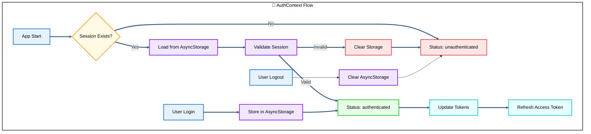

**Funcionalidades:**

- ✅ **Persistencia automática** con AsyncStorage
- ✅ **Gestión de tokens JWT** (access/refresh)
- ✅ **Estados de autenticación** (loading/authenticated/unauthenticated)
- ✅ **Hooks especializados** (`useAuth`, `useUser`, `useTokens`)

**Estructura de datos:**

```typescript
interface AuthSession {
  user: User;
  backendTokens: {
    accessToken: string;
    refreshToken: string;
    expiresIn: number;
  };
}
```

### 📍 SocketContext

**Ubicación:** `/contexts/SocketContext.tsx`

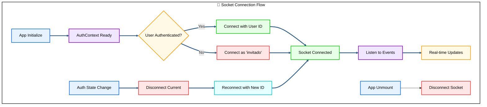

**Características:**

- ✅ **Conexión automática** independiente del estado de auth
- ✅ **ID dinámico** (usuario real o "invitado")
- ✅ **Reconexión automática** al cambiar sesión
- ✅ **Path personalizado** `/socket`

---

## 🎣 Hooks Personalizados

### 📍 useAuthActions

**Ubicación:** `/hooks/useAuthActions.ts`

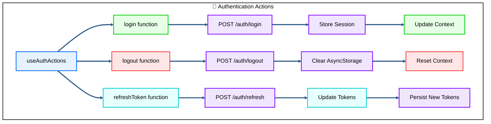

**API:**

```typescript
const { login, logout, refreshToken, loading, isAuthenticated } = useAuthActions();

// Login with credentials
await login({ username: 'user', password: 'pass' });

// Logout
await logout();

// Refresh tokens
await refreshToken();
```

### 📍 register.hook

**Ubicación:** `/hooks/register.hook.ts`

```mermaid
graph TB
    subgraph registration_process ["📝 Registration Process"]
        A[useRegisterForm] --> B[Form Validation]
        B --> C[Image Processing]
        C --> D{Platform Check}
        D -->|Web| E[Convert to File Object]
        D -->|Native| F[Use URI Format]

        E --> G[Create FormData]
        F --> G

        G --> H[POST /auth/register]
        H --> I{Success?}
        I -->|Yes| J[Navigate to Confirm]
        I -->|No| K[Show Error]
    end

    %% Node styling
    style A fill:#e6f3ff,stroke:#0066ff,stroke-width:2px,color:#000000
    style B fill:#f0e6ff,stroke:#8000ff,stroke-width:2px,color:#000000
    style C fill:#e6ffff,stroke:#00cccc,stroke-width:2px,color:#000000
    style D fill:#fff9e6,stroke:#ff9900,stroke-width:2px,color:#000000
    style E fill:#f0e6ff,stroke:#8000ff,stroke-width:2px,color:#000000
    style F fill:#f0e6ff,stroke:#8000ff,stroke-width:2px,color:#000000
    style G fill:#fff9e6,stroke:#ff9900,stroke-width:2px,color:#000000
    style H fill:#f0e6ff,stroke:#8000ff,stroke-width:2px,color:#000000
    style I fill:#fff9e6,stroke:#ff9900,stroke-width:2px,color:#000000
    style J fill:#e6ffe6,stroke:#00cc00,stroke-width:2px,color:#000000
    style K fill:#ffe6e6,stroke:#ff3333,stroke-width:2px,color:#000000

    %% Subgraph styling
    style registration_process fill:#ffffff,stroke:#333333,stroke-width:2px,color:#000000

    %% Link styling
    linkStyle 0 stroke:#2d5a87,stroke-width:3px
    linkStyle 1 stroke:#2d5a87,stroke-width:3px
    linkStyle 2 stroke:#2d5a87,stroke-width:3px
    linkStyle 3 stroke:#2d5a87,stroke-width:3px
    linkStyle 4 stroke:#2d5a87,stroke-width:3px
    linkStyle 5 stroke:#2d5a87,stroke-width:3px
    linkStyle 6 stroke:#2d5a87,stroke-width:3px
    linkStyle 7 stroke:#2d5a87,stroke-width:3px
    linkStyle 8 stroke:#2d5a87,stroke-width:3px
    linkStyle 9 stroke:#2d5a87,stroke-width:3px
```

**Validaciones (Zod):**

- ✅ **Campos obligatorios** (nombre, apellidos, correo, etc.)
- ✅ **Imagen de perfil** obligatoria
- ✅ **Formato de teléfono** (9 dígitos)
- ✅ **Confirmación de contraseña**

### 📍 datosApi.hook

**Ubicación:** `/hooks/datosApi.hook.ts`

```mermaid
graph TB
    subgraph api_data_management ["🌐 API Data Management"]
        A[useDatosApi] --> B[Check Route Type]
        B --> C{Protected Route?}
        C -->|Yes| D[Add Auth Headers]
        C -->|No| E[Public Request]

        D --> F[Include Access Token]
        F --> G[Make Request]
        E --> G

        G --> H{Token Expired?}
        H -->|Yes| I[Auto Refresh]
        I --> J[Retry Request]
        H -->|No| K[Return Response]
        J --> K
    end

    %% Node styling
    style A fill:#e6f3ff,stroke:#0066ff,stroke-width:2px,color:#000000
    style B fill:#f0e6ff,stroke:#8000ff,stroke-width:2px,color:#000000
    style C fill:#fff9e6,stroke:#ff9900,stroke-width:2px,color:#000000
    style D fill:#e6ffe6,stroke:#00cc00,stroke-width:2px,color:#000000
    style E fill:#ffe6e6,stroke:#ff3333,stroke-width:2px,color:#000000
    style F fill:#e6ffff,stroke:#00cccc,stroke-width:2px,color:#000000
    style G fill:#f0e6ff,stroke:#8000ff,stroke-width:2px,color:#000000
    style H fill:#fff9e6,stroke:#ff9900,stroke-width:2px,color:#000000
    style I fill:#fff9e6,stroke:#ff9900,stroke-width:2px,color:#000000
    style J fill:#e6ffff,stroke:#00cccc,stroke-width:2px,color:#000000
    style K fill:#e6ffe6,stroke:#00cc00,stroke-width:2px,color:#000000

    %% Subgraph styling
    style api_data_management fill:#ffffff,stroke:#333333,stroke-width:2px,color:#000000

    %% Link styling
    linkStyle 0 stroke:#2d5a87,stroke-width:3px
    linkStyle 1 stroke:#2d5a87,stroke-width:3px
    linkStyle 2 stroke:#2d5a87,stroke-width:3px
    linkStyle 3 stroke:#2d5a87,stroke-width:3px
    linkStyle 4 stroke:#2d5a87,stroke-width:3px
    linkStyle 5 stroke:#2d5a87,stroke-width:3px
    linkStyle 6 stroke:#2d5a87,stroke-width:3px
    linkStyle 7 stroke:#2d5a87,stroke-width:3px
    linkStyle 8 stroke:#2d5a87,stroke-width:3px
    linkStyle 9 stroke:#2d5a87,stroke-width:3px
    linkStyle 10 stroke:#2d5a87,stroke-width:3px
```

### 📍 useSocketNotifications

**Ubicación:** `/hooks/useSocketNotifications.ts`

**Eventos manejados:**

- 🔔 `notification` - Nueva notificación
- 📋 `notificationsUpdate` - Actualización de lista
- ✅ `markNotificationRead` - Marcar como leído

---

## � Ejemplos Prácticos de Implementación

### 📤 Envío de Archivos al Servidor

#### 🔄 Particularidades Web vs Mobile

El envío de archivos tiene diferencias importantes entre plataformas. Aquí te mostramos cómo manejar ambos casos:

**📱 Implementación Completa en register.hook.ts:**

```typescript
// hooks/register.hook.ts
import { useForm } from 'react-hook-form';
import { zodResolver } from '@hookform/resolvers/zod';
import * as ImagePicker from 'expo-image-picker';
import { Platform } from 'react-native';
import { RegisterSchema } from '../schemas/auth.schema';

export const useRegisterForm = () => {
  const form = useForm({
    resolver: zodResolver(RegisterSchema),
    mode: 'onChange',
  });

  // 📸 Selección de imagen
  const pickImage = async () => {
    const result = await ImagePicker.launchImageLibraryAsync({
      mediaTypes: ImagePicker.MediaTypeOptions.Images,
      allowsEditing: true,
      aspect: [1, 1],
      quality: 0.8,
    });

    if (!result.canceled && result.assets[0]) {
      const imageUri = result.assets[0];
      form.setValue('imagePerfil', imageUri);
    }
  };

  // 🚀 Envío del formulario
  const onSubmit = async (data) => {
    console.log('=== REGISTRO DEBUG ===');
    console.log('Datos del formulario:', data);

    const formData = new FormData();

    // ✅ Campos de texto normales
    formData.append('nombre', data.nombre);
    formData.append('apellidos', data.apellidos);
    formData.append('correo', data.correo);
    formData.append('telefono', data.telefono);
    formData.append('direccion', data.direccion);
    formData.append('fecha_nacimiento', data.fecha_nacimiento);
    formData.append('password', data.password);

    // 🔥 DIFERENCIA CRÍTICA: Manejo de imagen por plataforma
    if (data.imagePerfil) {
      if (Platform.OS === 'web') {
        // 🌐 WEB: Crear File object compatible
        const response = await fetch(data.imagePerfil.uri);
        const blob = await response.blob();
        const file = new File([blob], 'profile.jpg', {
          type: 'image/jpeg',
        });
        formData.append('imagePerfil', file);
        console.log('📁 Archivo para WEB:', file);
      } else {
        // 📱 MOBILE: Usar URI directamente con react-native
        formData.append('imagePerfil', {
          uri: data.imagePerfil.uri,
          type: 'image/jpeg',
          name: 'profile.jpg',
        } as any);
        console.log('📱 Archivo para MOBILE:', data.imagePerfil.uri);
      }
    }

    try {
      // 📡 Envío con headers correctos para multipart
      const response = await apiClient.post('/auth/register', formData, {
        headers: {
          'Content-Type': 'multipart/form-data',
        },
      });

      console.log('✅ Registro exitoso:', response.data);
      // Navegar a confirmación
      router.push('/confirm-registration');
    } catch (error) {
      console.error('❌ Error en registro:', error);
      // Mostrar error al usuario
    }
  };

  return { form, pickImage, onSubmit, loading };
};
```

#### 🎯 Puntos Clave del Envío de Archivos:

1. **🌐 Web:** Convertir URI a File object usando `fetch()` y `blob()`
2. **📱 Mobile:** Usar objeto con `uri`, `type`, y `name`
3. **📦 FormData:** Siempre usar para archivos
4. **🔧 Headers:** `Content-Type: multipart/form-data`

### 🔐 Uso del AuthContext

#### 📖 Consumir el Contexto de Autenticación

```typescript
// components/ProtectedComponent.tsx
import { useAuth, useUser, useTokens } from '../contexts/AuthContext';

export const ProtectedComponent = () => {
  // 🔍 Hook principal - estado completo
  const { status, session, login, logout } = useAuth();

  // 👤 Hook específico - solo datos del usuario
  const user = useUser();

  // 🎫 Hook específico - solo tokens
  const tokens = useTokens();

  // 🔄 Estados de autenticación
  if (status === 'loading') {
    return <LoadingSpinner />;
  }

  if (status === 'unauthenticated') {
    return <LoginPrompt />;
  }

  // ✅ Usuario autenticado
  return (
    <View>
      <Text>¡Hola {user?.nombre}!</Text>
      <Text>Rol: {user?.roles?.nombre}</Text>
      <Text>Verificado: {user?.verificado ? '✅' : '❌'}</Text>

      <Button
        title="Cerrar Sesión"
        onPress={() => logout()}
      />
    </View>
  );
};
```

#### 🎣 Hooks Especializados

```typescript
// hooks/auth/useAuthGuard.ts - Hook personalizado de protección
import { useAuth } from '../contexts/AuthContext';
import { useRouter } from 'expo-router';
import { useEffect } from 'react';

export const useAuthGuard = (redirectTo: string = '/sign-in') => {
  const { status } = useAuth();
  const router = useRouter();

  useEffect(() => {
    if (status === 'unauthenticated') {
      router.replace(redirectTo);
    }
  }, [status, redirectTo]);

  return status === 'authenticated';
};

// Uso en componentes
export const ProtectedPage = () => {
  const isAuthenticated = useAuthGuard();

  if (!isAuthenticated) {
    return null; // o LoadingSpinner
  }

  return <YourProtectedContent />;
};
```

### 🔌 Uso del SocketContext

#### 📡 Implementación Completa del Socket

```typescript
// components/NotificationCenter.tsx
import { useSocket } from '../contexts/SocketContext';
import { useEffect, useState } from 'react';

export const NotificationCenter = () => {
  const socket = useSocket();
  const [notifications, setNotifications] = useState([]);
  const [connectionStatus, setConnectionStatus] = useState('disconnected');

  useEffect(() => {
    if (!socket) return;

    // 🔗 Estados de conexión
    socket.on('connect', () => {
      console.log('🔌 Socket conectado:', socket.id);
      setConnectionStatus('connected');
    });

    socket.on('disconnect', () => {
      console.log('❌ Socket desconectado');
      setConnectionStatus('disconnected');
    });

    // 🔔 Escuchar notificaciones
    socket.on('notification', (data) => {
      console.log('📬 Nueva notificación:', data);
      setNotifications(prev => [data, ...prev]);

      // 🎵 Mostrar toast o sonido
      showNotificationToast(data);
    });

    // 📋 Actualización masiva de notificaciones
    socket.on('notificationsUpdate', (allNotifications) => {
      console.log('🔄 Actualización de notificaciones:', allNotifications);
      setNotifications(allNotifications);
    });

    // 🧹 Cleanup al desmontar
    return () => {
      socket.off('connect');
      socket.off('disconnect');
      socket.off('notification');
      socket.off('notificationsUpdate');
    };
  }, [socket]);

  // 📤 Emitir eventos al servidor
  const markAsRead = (notificationId: string) => {
    if (socket) {
      socket.emit('markNotificationRead', {
        notificationId,
        timestamp: new Date().toISOString()
      });

      // Actualizar estado local
      setNotifications(prev =>
        prev.map(notif =>
          notif.id === notificationId
            ? { ...notif, read: true }
            : notif
        )
      );
    }
  };

  // 📨 Enviar mensaje personalizado
  const sendCustomEvent = (eventName: string, data: any) => {
    if (socket?.connected) {
      socket.emit(eventName, data);
      console.log(`📡 Evento enviado: ${eventName}`, data);
    } else {
      console.warn('⚠️ Socket no conectado');
    }
  };

  return (
    <View>
      <View style={styles.status}>
        <Text>Estado: {connectionStatus}</Text>
        <Text>Socket ID: {socket?.id || 'N/A'}</Text>
      </View>

      <FlatList
        data={notifications}
        keyExtractor={(item) => item.id}
        renderItem={({ item }) => (
          <NotificationItem
            notification={item}
            onMarkRead={() => markAsRead(item.id)}
          />
        )}
      />
    </View>
  );
};
```

#### 🎯 Eventos Socket Personalizados

```typescript
// hooks/useSocketNotifications.ts - Hook personalizado
import { useSocket } from '../contexts/SocketContext';
import { useEffect, useCallback } from 'react';

export const useSocketNotifications = () => {
  const socket = useSocket();

  // 📢 Suscribirse a eventos específicos
  const subscribeToEvent = useCallback(
    (eventName: string, callback: Function) => {
      if (socket) {
        socket.on(eventName, callback);
        return () => socket.off(eventName, callback);
      }
    },
    [socket]
  );

  // 📤 Emitir evento con validación
  const emitEvent = useCallback(
    (eventName: string, data: any) => {
      if (socket?.connected) {
        socket.emit(eventName, data);
        return true;
      }
      console.warn(`⚠️ No se pudo emitir ${eventName}: Socket desconectado`);
      return false;
    },
    [socket]
  );

  // 🔔 Eventos predefinidos de la app
  const notificationEvents = {
    // Escuchar nueva notificación
    onNewNotification: (callback: (data: any) => void) =>
      subscribeToEvent('notification', callback),

    // Escuchar actualización de estado
    onStatusUpdate: (callback: (status: any) => void) => subscribeToEvent('statusUpdate', callback),

    // Emitir que usuario está online
    setUserOnline: () => emitEvent('userOnline', { timestamp: Date.now() }),

    // Emitir actividad del usuario
    trackUserActivity: (activity: string) =>
      emitEvent('userActivity', { activity, timestamp: Date.now() }),
  };

  return {
    socket,
    subscribeToEvent,
    emitEvent,
    ...notificationEvents,
  };
};
```

### 📊 Uso del Hook datosApi

#### 🌐 Cliente API con Autenticación Automática

```typescript
// components/ProductList.tsx
import { useDatosApi } from '../hooks/datosApi.hook';
import { useEffect, useState } from 'react';

export const ProductList = () => {
  const { loading, error, makeRequest } = useDatosApi();
  const [products, setProducts] = useState([]);
  const [categories, setCategories] = useState([]);

  // 📥 Cargar datos al inicializar
  useEffect(() => {
    loadInitialData();
  }, []);

  const loadInitialData = async () => {
    try {
      // 🔓 Ruta pública - sin autenticación
      const categoriesResponse = await makeRequest({
        method: 'GET',
        url: '/public/categories',
        requireAuth: false
      });
      setCategories(categoriesResponse.data);

      // 🔐 Ruta protegida - con autenticación automática
      const productsResponse = await makeRequest({
        method: 'GET',
        url: '/user/products',
        requireAuth: true
      });
      setProducts(productsResponse.data);

    } catch (error) {
      console.error('❌ Error cargando datos:', error);
    }
  };

  // 🛒 Comprar producto (POST con datos)
  const purchaseProduct = async (productId: string) => {
    try {
      const response = await makeRequest({
        method: 'POST',
        url: '/user/purchase',
        data: {
          productId,
          paymentMethod: 'credit_card',
          timestamp: new Date().toISOString()
        },
        requireAuth: true
      });

      console.log('✅ Compra exitosa:', response.data);

      // Actualizar lista de productos
      await loadInitialData();

    } catch (error) {
      console.error('❌ Error en compra:', error);
      Alert.alert('Error', 'No se pudo completar la compra');
    }
  };

  // ❤️ Agregar a favoritos (PUT)
  const toggleFavorite = async (productId: string, isFavorite: boolean) => {
    try {
      await makeRequest({
        method: 'PUT',
        url: `/user/products/${productId}/favorite`,
        data: { isFavorite: !isFavorite },
        requireAuth: true
      });

      // Actualizar estado local
      setProducts(prev =>
        prev.map(product =>
          product.id === productId
            ? { ...product, isFavorite: !isFavorite }
            : product
        )
      );

    } catch (error) {
      console.error('❌ Error actualizando favorito:', error);
    }
  };

  if (loading) {
    return <LoadingSpinner />;
  }

  if (error) {
    return <ErrorMessage error={error} onRetry={loadInitialData} />;
  }

  return (
    <FlatList
      data={products}
      keyExtractor={(item) => item.id}
      renderItem={({ item }) => (
        <ProductCard
          product={item}
          onPurchase={() => purchaseProduct(item.id)}
          onToggleFavorite={() => toggleFavorite(item.id, item.isFavorite)}
        />
      )}
    />
  );
};
```

#### 🔧 Hook datosApi - Configuraciones Avanzadas

```typescript
// hooks/useApiWithRefresh.ts - Extensión con retry automático
import { useDatosApi } from './datosApi.hook';
import { useCallback } from 'react';

export const useApiWithRefresh = () => {
  const { makeRequest } = useDatosApi();

  // 🔄 Request con retry automático
  const requestWithRetry = useCallback(
    async (config, maxRetries = 3) => {
      let lastError;

      for (let attempt = 1; attempt <= maxRetries; attempt++) {
        try {
          const response = await makeRequest(config);
          return response;
        } catch (error) {
          lastError = error;
          console.warn(`⚠️ Intento ${attempt}/${maxRetries} falló:`, error.message);

          // Esperar antes del siguiente intento
          if (attempt < maxRetries) {
            await new Promise((resolve) => setTimeout(resolve, 1000 * attempt));
          }
        }
      }

      throw lastError;
    },
    [makeRequest]
  );

  // 📤 Upload de archivos con progreso
  const uploadFile = useCallback(
    async (file, onProgress?) => {
      const formData = new FormData();
      formData.append('file', file);

      return makeRequest({
        method: 'POST',
        url: '/upload',
        data: formData,
        requireAuth: true,
        headers: {
          'Content-Type': 'multipart/form-data',
        },
        onUploadProgress: onProgress,
      });
    },
    [makeRequest]
  );

  // 📊 Paginación automática
  const getPaginatedData = useCallback(
    async (endpoint, page = 1, limit = 10) => {
      return makeRequest({
        method: 'GET',
        url: `${endpoint}?page=${page}&limit=${limit}`,
        requireAuth: true,
      });
    },
    [makeRequest]
  );

  return {
    requestWithRetry,
    uploadFile,
    getPaginatedData,
  };
};
```

#### 💡 Ejemplos de Uso Específicos

```typescript
// Ejemplo 1: Cargar perfil de usuario
const loadUserProfile = async () => {
  const response = await makeRequest({
    method: 'GET',
    url: '/user/profile',
    requireAuth: true,
  });
  return response.data;
};

// Ejemplo 2: Actualizar configuración
const updateSettings = async (settings) => {
  return makeRequest({
    method: 'PATCH',
    url: '/user/settings',
    data: settings,
    requireAuth: true,
  });
};

// Ejemplo 3: Buscar productos públicos
const searchPublicProducts = async (query) => {
  return makeRequest({
    method: 'GET',
    url: `/public/search?q=${encodeURIComponent(query)}`,
    requireAuth: false,
  });
};

// Ejemplo 4: Descargar archivo protegido
const downloadFile = async (fileId) => {
  return makeRequest({
    method: 'GET',
    url: `/user/download/${fileId}`,
    requireAuth: true,
    responseType: 'blob', // Para archivos
  });
};
```

---

## �🗂️ Interfaces y Tipos

### 📍 interfaces.ts

**Ubicación:** `/interfaces/interfaces.ts`

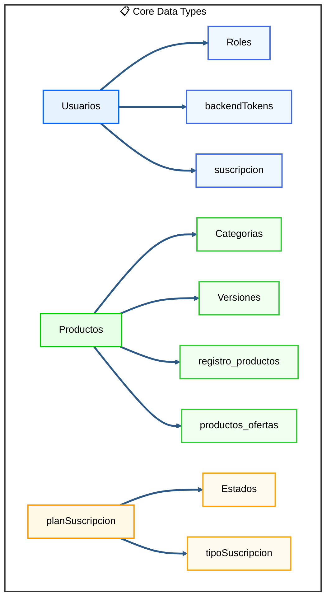

**Tipos principales:**

```typescript
// Usuario del sistema
interface Usuarios {
  id: string;
  nombre: string;
  apellidos: string;
  correo: string;
  telefono: string | null;
  direccion: string | null;
  fecha_nacimiento: Date | null;
  urlPerfil: string | null;
  rol_id: string;
  verificado: boolean;
  roles: Roles;
  suscripcion?: suscripcion;
}

// Producto digital
interface Productos {
  id: string;
  id_categoria: number;
  oferta: boolean;
  compra: boolean;
  like: boolean;
  nombre: string;
  descripcion: string;
  precio: number;
  precio_actual: {
    precio: number;
    descuento: number;
  };
  fecha_registro: Date;
  requisitos_tecnicos: string;
  categorias: Categorias;
  versiones: Versiones[];
  productos_ofertas: productos_ofertas[];
}

// Tokens de autenticación
interface backendTokens {
  accessToken: string;
  refreshToken: string;
  expiresIn: number;
}
```

---

## ⚡ Librerías Core (Lib)

### 📍 apiClient.ts

**Ubicación:** `/lib/apiClient.ts`

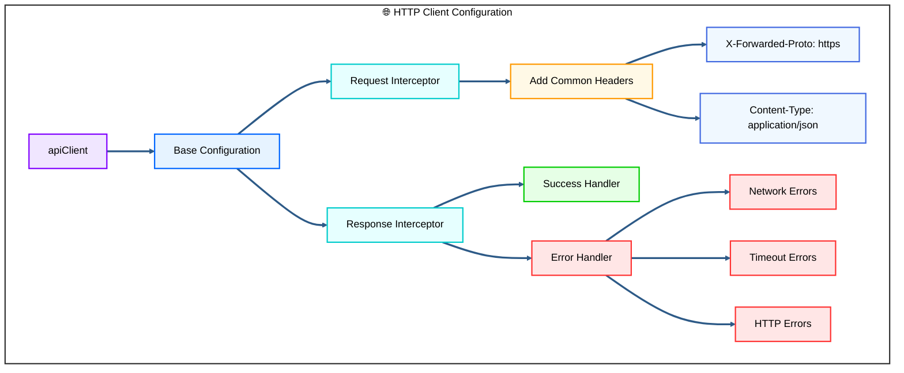

**Configuración:**

```typescript
const apiConfig = {
  baseURL: process.env.EXPO_PUBLIC_API_URL,
  timeout: 10000,
  headers: {
    'Content-Type': 'application/json',
    'X-Forwarded-Proto': 'https',
  },
};
```

**Funciones utilitarias:**

- ✅ `handleApiResponse` - Procesamiento de respuestas exitosas
- ✅ `handleApiError` - Manejo unificado de errores
- ✅ Interceptores automáticos para headers y errores

### 📍 utils.ts

**Funciones de utilidad:**

- 🔧 `cn()` - Combinador de clases CSS
- 🎨 Helpers para estilos y formateo

### 📍 theme.ts

**Gestión de temas:**

- 🌙 Tema oscuro/claro
- 🎨 Paleta de colores
- 📱 Configuración para React Navigation

---

## 📱 Rutas de la Aplicación

### 📍 Páginas Principales

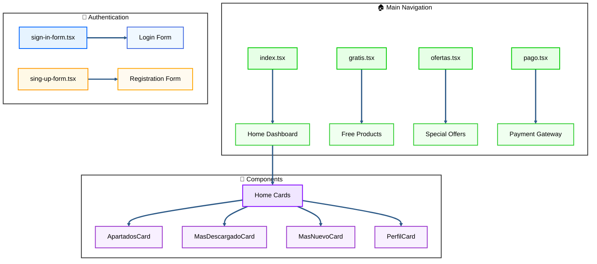

#### 🏠 index.tsx - Dashboard Principal

**Ubicación:** `/app/index.tsx`

**Características:**

- ✅ **Layout responsivo** con AppLayout
- ✅ **Tarjetas dinámicas** de productos
- ✅ **Navegación contextual**
- ✅ **Datos mock** para desarrollo

**Componentes integrados:**

- 📊 `ApartadosCard` - Navegación por secciones
- ⬇️ `MasDescargadoCard` - Productos más populares
- 🆕 `MasNuevoCard` - Últimos lanzamientos
- 👤 `PerfilCard` - Información del usuario

#### 🆓 gratis.tsx - Productos Gratuitos

**Características:**

- ✅ **Lista de productos gratis**
- ✅ **Filtrado por categorías**
- ✅ **Descarga directa**

#### 🏷️ ofertas.tsx - Ofertas Especiales

**Características:**

- ✅ **Productos con descuento**
- ✅ **Comparación de precios**
- ✅ **Tiempo limitado**

#### 💳 pago.tsx - Gateway de Pagos

**Características:**

- ✅ **Múltiples métodos de pago**
- ✅ **Proceso seguro**
- ✅ **Confirmación de compra**

#### 🔐 sign-in-form.tsx - Inicio de Sesión

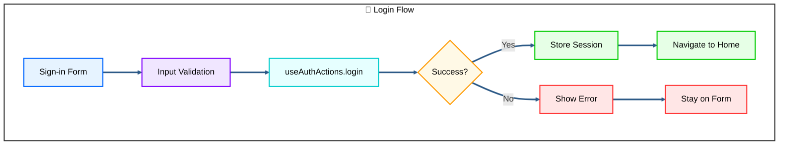

**Campos:**

- 📧 **Username/Email**
- 🔒 **Password**
- 💾 **Remember me** (opcional)

#### 📝 sing-up-form.tsx - Registro

```mermaid
graph TB
    subgraph registration_flow_page ["📝 Registration Flow"]
        A[Sign-up Form] --> B[Form Validation]
        B --> C[Image Upload]
        C --> D[useRegisterForm.onSubmit]
        D --> E[Create FormData]
        E --> F[POST /auth/register]
        F --> G{Success?}
        G -->|Yes| H[Navigate to Confirm]
        G -->|No| I[Show Errors]
    end

    %% Node styling
    style A fill:#e6f3ff,stroke:#0066ff,stroke-width:2px,color:#000000
    style B fill:#f0e6ff,stroke:#8000ff,stroke-width:2px,color:#000000
    style C fill:#e6ffff,stroke:#00cccc,stroke-width:2px,color:#000000
    style D fill:#fff9e6,stroke:#ff9900,stroke-width:2px,color:#000000
    style E fill:#f0e6ff,stroke:#8000ff,stroke-width:2px,color:#000000
    style F fill:#f0e6ff,stroke:#8000ff,stroke-width:2px,color:#000000
    style G fill:#fff9e6,stroke:#ff9900,stroke-width:2px,color:#000000
    style H fill:#e6ffe6,stroke:#00cc00,stroke-width:2px,color:#000000
    style I fill:#ffe6e6,stroke:#ff3333,stroke-width:2px,color:#000000

    %% Subgraph styling
    style registration_flow_page fill:#ffffff,stroke:#333333,stroke-width:2px,color:#000000

    %% Link styling
    linkStyle 0 stroke:#2d5a87,stroke-width:3px
    linkStyle 1 stroke:#2d5a87,stroke-width:3px
    linkStyle 2 stroke:#2d5a87,stroke-width:3px
    linkStyle 3 stroke:#2d5a87,stroke-width:3px
    linkStyle 4 stroke:#2d5a87,stroke-width:3px
    linkStyle 5 stroke:#2d5a87,stroke-width:3px
    linkStyle 6 stroke:#2d5a87,stroke-width:3px
    linkStyle 7 stroke:#2d5a87,stroke-width:3px
```

**Campos obligatorios:**

- 👤 **Nombre y Apellidos**
- 📧 **Correo electrónico**
- 📱 **Teléfono** (9 dígitos)
- 🏠 **Dirección**
- 📅 **Fecha de nacimiento**
- 🔒 **Contraseña y confirmación**
- 📸 **Imagen de perfil** (obligatoria)

---

## 🔧 Configuración y Setup

### 📦 Instalación

```bash
# Clonar repositorio
git clone [repository-url]
cd app-convertsystems

# Instalar dependencias
pnpm install

# Variables de entorno
cp .env.example .env.local
```

### ⚙️ Variables de Entorno

```bash
EXPO_PUBLIC_API_URL=https://api.convertsystems.store
EXPO_PUBLIC_URL_BACKEND=https://api.convertsystems.store
EXPO_PUBLIC_URL_BOT=https://bot.convertsystems.store
```

### 🚀 Scripts Disponibles

```bash
# Desarrollo
pnpm dev          # Expo start con cache limpio
pnpm android      # Ejecutar en Android
pnpm ios          # Ejecutar en iOS
pnpm web          # Ejecutar en navegador

# Utilidades
pnpm clean        # Limpiar cache y node_modules
```

---

## 🔄 Flujos de Datos

### 📊 Flujo de Autenticación

```mermaid
graph TB
    subgraph auth_data_flow ["🔐 Authentication Data Flow"]
        A[User Input] --> B[useAuthActions]
        B --> C[apiClient.post]
        C --> D[Backend API]
        D --> E{Valid Credentials?}
        E -->|Yes| F[Return Session + Tokens]
        E -->|No| G[Return Error]

        F --> H[AuthContext.login]
        H --> I[AsyncStorage.setItem]
        I --> J[Update Context State]
        J --> K[Navigate to Home]

        G --> L[Show Error Message]
        L --> M[Stay on Login]
    end

    %% Node styling
    style A fill:#e6f3ff,stroke:#0066ff,stroke-width:2px,color:#000000
    style B fill:#e6ffff,stroke:#00cccc,stroke-width:2px,color:#000000
    style C fill:#f0e6ff,stroke:#8000ff,stroke-width:2px,color:#000000
    style D fill:#fff9e6,stroke:#ff9900,stroke-width:2px,color:#000000
    style E fill:#fff9e6,stroke:#ff9900,stroke-width:2px,color:#000000
    style F fill:#e6ffe6,stroke:#00cc00,stroke-width:2px,color:#000000
    style G fill:#ffe6e6,stroke:#ff3333,stroke-width:2px,color:#000000
    style H fill:#e6ffff,stroke:#00cccc,stroke-width:2px,color:#000000
    style I fill:#f0e6ff,stroke:#8000ff,stroke-width:2px,color:#000000
    style J fill:#e6f3ff,stroke:#0066ff,stroke-width:2px,color:#000000
    style K fill:#e6ffe6,stroke:#00cc00,stroke-width:2px,color:#000000
    style L fill:#ffe6e6,stroke:#ff3333,stroke-width:2px,color:#000000
    style M fill:#ffe6e6,stroke:#ff3333,stroke-width:2px,color:#000000

    %% Subgraph styling
    style auth_data_flow fill:#ffffff,stroke:#333333,stroke-width:2px,color:#000000

    %% Link styling
    linkStyle 0 stroke:#2d5a87,stroke-width:3px
    linkStyle 1 stroke:#2d5a87,stroke-width:3px
    linkStyle 2 stroke:#2d5a87,stroke-width:3px
    linkStyle 3 stroke:#2d5a87,stroke-width:3px
    linkStyle 4 stroke:#2d5a87,stroke-width:3px
    linkStyle 5 stroke:#2d5a87,stroke-width:3px
    linkStyle 6 stroke:#2d5a87,stroke-width:3px
    linkStyle 7 stroke:#2d5a87,stroke-width:3px
    linkStyle 8 stroke:#2d5a87,stroke-width:3px
    linkStyle 9 stroke:#2d5a87,stroke-width:3px
    linkStyle 10 stroke:#2d5a87,stroke-width:3px
    linkStyle 11 stroke:#2d5a87,stroke-width:3px
```

### 📡 Flujo de Socket

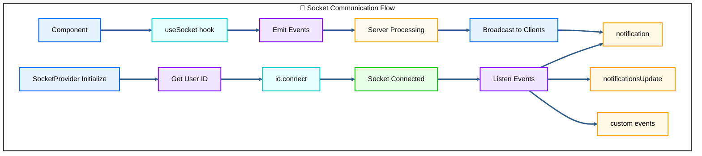

---

## 🧪 Testing y Debugging

### 🔍 Logs de Desarrollo

La aplicación incluye logs detallados para debugging:

```typescript
// AuthContext
console.log('Sesión cargada desde AsyncStorage:', session);
console.log('Estado de autenticación:', status);

// SocketContext
console.log('Socket conectado exitosamente:', socket.id);
console.log('Conectando socket para usuario:', userId);

// Registration
console.log('=== REGISTRO DEBUG ===');
console.log('Datos del formulario:', data);
```

### 🛠️ Herramientas de Debug

- 📱 **Expo Dev Tools** para debugging
- 🔍 **Flipper** para inspección de red
- 📊 **React DevTools** para componentes
- 🗄️ **AsyncStorage Inspector** para persistencia

---

## 📈 Métricas y Rendimiento

### ⚡ Optimizaciones Implementadas

- ✅ **Lazy Loading** de componentes
- ✅ **AsyncStorage** para persistencia eficiente
- ✅ **Interceptores HTTP** para manejo centralizado
- ✅ **Socket connection pooling**
- ✅ **Memoización** en componentes críticos

### 📊 Bundle Size

| Paquete           | Tamaño | Impacto |
| ----------------- | ------ | ------- |
| React Native Core | ~2.5MB | Alto    |
| Expo Router       | ~800KB | Medio   |
| Socket.io Client  | ~300KB | Bajo    |
| UI Components     | ~500KB | Bajo    |

---

## 🔮 Roadmap y Futuras Mejoras

### 🎯 Próximas Funcionalidades

- [ ] **Push Notifications** con Expo Notifications
- [ ] **Offline Support** con Redux Persist
- [ ] **Biometric Authentication**
- [ ] **Deep Linking** avanzado
- [ ] **Performance Monitoring** con Sentry
- [ ] **CI/CD Pipeline** con GitHub Actions

### 🏗️ Refactoring Pendiente

- [ ] **Migración a Zustand** para estado global
- [ ] **Implementación de React Query** para cache
- [ ] **Testing Suite** con Jest y Detox
- [ ] **Documentación con Storybook**

---

## 👥 Equipo y Contribución

### 🤝 Cómo Contribuir

1. Fork del repositorio
2. Crear rama feature: `git checkout -b feature/nueva-funcionalidad`
3. Commit cambios: `git commit -m 'Añadir nueva funcionalidad'`
4. Push a la rama: `git push origin feature/nueva-funcionalidad`
5. Crear Pull Request

### 📋 Estándares de Código

- ✅ **TypeScript** para tipado estático
- ✅ **ESLint** para linting
- ✅ **Prettier** para formateo
- ✅ **Conventional Commits** para mensajes

---

## 📄 Licencia

Este proyecto está bajo la licencia **MIT**. Ver `LICENSE` para más detalles.

---

## 📞 Contacto y Soporte

- 🌐 **Website:** [convertsystems.store](https://convertsystems.store)
- 📧 **Email:** soporte@convertsystems.store
- 📱 **API Docs:** [api.convertsystems.store/docs](https://api.convertsystems.store/docs)

---

_Documentación actualizada - 2025 | Desarrollado con ❤️ por el equipo de Convert Systems_

- ⚙️ **Configuraciones**: Personalización completa de la aplicación
- 📱 **Responsive Design**: Optimizado para móvil con safe areas
- 🌙 **Modo Oscuro**: Soporte completo para tema claro/oscuro

## 🚀 Inicio Rápido

### 1. Instalación

```bash
# Clonar el repositorio
git clone https://github.com/2004Style/app-convertsystems.git
cd app-convertsystems

# Instalar dependencias
pnpm install
# o
npm install
```

### 2. Ejecutar la aplicación

```bash
# Desarrollo web
pnpm run web

# Desarrollo móvil (requiere Expo Go)
pnpm run dev

# Comandos específicos
pnpm run ios     # iOS (Solo Mac)
pnpm run android # Android
```

### 3. Abrir la aplicación

- **Web**: Abre automáticamente en `http://localhost:8081`
- **Móvil**: Escanea el código QR con [Expo Go](https://expo.dev/go)
- **Simuladores**: Presiona `i` (iOS) o `a` (Android) en la terminal

## 📂 Estructura del Proyecto

```
app-convertsystems/
├── app/                          # Páginas de la aplicación (Expo Router)
│   ├── _layout.tsx              # Layout raíz con SafeAreaProvider
│   ├── index.tsx                # Página principal/bienvenida
│   ├── sign-in-form.tsx         # Formulario de inicio de sesión
│   ├── sing-up-form.tsx         # Formulario de registro
│   ├── profile.tsx              # Perfil del usuario
│   ├── purchases.tsx            # Historial de compras
│   ├── favorites.tsx            # Productos favoritos
│   ├── notifications.tsx        # Centro de notificaciones
│   └── settings.tsx             # Configuraciones
├── components/
│   ├── navigation/              # Sistema de navegación
│   │   ├── app-layout.tsx       # Layout principal con safe areas
│   │   ├── header.tsx           # Barra de navegación superior
│   │   └── side-menu.tsx        # Menú lateral
│   ├── ui/                      # Componentes UI reutilizables
│   └── *.tsx                    # Componentes específicos (forms, etc.)
├── lib/
│   ├── theme.ts                 # Configuración de temas
│   └── utils.ts                 # Utilidades y helpers
├── hooks/                       # Hooks personalizados
│   └── register.hook.ts         # Hook para registro de usuarios
└── routes/                      # Configuración de rutas backend
    ├── auth.routes.ts
    ├── products.routes.ts
    └── profile.routes.ts
```

## 🔧 Cómo Agregar una Nueva Página

### Paso 1: Crear el archivo de la página

Crea un nuevo archivo en la carpeta `app/` siguiendo la convención de Expo Router:

```bash
# Ejemplo: Crear página de productos
touch app/products.tsx
```

### Paso 2: Estructura básica de la página

```tsx
// app/products.tsx
import { AppLayout } from '@/components/navigation/app-layout';
import { Text } from '@/components/ui/text';
import { Stack } from 'expo-router';
import { ScrollView } from 'react-native';

export default function ProductsScreen() {
  return (
    <>
      <Stack.Screen options={{ headerShown: false }} />
      <AppLayout title="Productos">
        <ScrollView
          className="flex-1"
          contentContainerStyle={{ flexGrow: 1, padding: 16 }}
          showsVerticalScrollIndicator={false}>
          <Text>Contenido de productos aquí</Text>
        </ScrollView>
      </AppLayout>
    </>
  );
}
```

### Paso 3: Agregar al menú lateral

Edita `components/navigation/side-menu.tsx` para incluir la nueva página:

```tsx
// Importar el icono necesario
import { Package } from 'lucide-react-native';

// Agregar el MenuItem en la sección correspondiente
<MenuItem icon={Package} title="Productos" onPress={() => navigateAndClose('/products')} />;
```

### Paso 4: (Opcional) Configurar rutas backend

Si la página necesita conectarse al backend, crea/edita el archivo de rutas correspondiente:

```typescript
// routes/products.routes.ts
const PRODUCTS_ROUTES = {
  GET_ALL: `${URL_API}/products`,
  GET_BY_ID: (id: string) => `${URL_API}/products/${id}`,
  CREATE: `${URL_API}/products`,
  // ...más rutas
};

export default PRODUCTS_ROUTES;
```

## 🎨 Personalización de UI

### Componentes disponibles

```bash
# Ver componentes disponibles
npx react-native-reusables/cli@latest add

# Agregar componentes específicos
npx react-native-reusables/cli@latest add dialog sheet tabs
```

### Temas y colores

Edita `lib/theme.ts` para personalizar:

- Colores del tema claro/oscuro
- Esquemas de navegación
- Variables de diseño

### Safe Areas y Layout

El `AppLayout` maneja automáticamente:

- Safe areas (notch, dynamic island, barras de sistema)
- Altura dinámica de ventana (equivalente a `100dvh`)
- Orientación automática
- Menú lateral contextual

## 🔌 Integración Backend

### Variables de entorno

Configura las URLs en tu archivo `.env`:

```env
EXPO_PUBLIC_URL_BACKEND=https://tu-backend.com
EXPO_PUBLIC_URL_API=https://tu-backend.com/api
EXPO_PUBLIC_URL_BOT=https://tu-bot.com
```

### Hooks personalizados

Los hooks en `hooks/` manejan la lógica de negocio:

- `register.hook.ts`: Registro de usuarios
- Agrega más hooks según necesites

## 📱 Optimizaciones Móviles

### KeyboardAvoidingView

Los formularios usan `KeyboardAvoidingView` automáticamente:

```tsx
<KeyboardAvoidingView
    behavior={Platform.OS === 'ios' ? 'padding' : 'height'}
    keyboardVerticalOffset={Platform.OS === 'ios' ? 0 : 20}
>
```

### ScrollView optimizado

Usa este patrón para listas scrolleables:

```tsx
<ScrollView
    className="flex-1"
    contentContainerStyle={{ flexGrow: 1, padding: 16 }}
    showsVerticalScrollIndicator={false}
>
```

---

## 🚀 Patrones Comunes y Guías Rápidas

### 🎯 Patrones de Implementación Frecuentes

#### 🔄 Patrón: Componente con Estado y API

```typescript
// components/DataComponent.tsx
import { useState, useEffect } from 'react';
import { useDatosApi } from '@/hooks/datosApi.hook';
import { useAuth } from '@/contexts/AuthContext';

export const DataComponent = () => {
  const { makeRequest, loading, error } = useDatosApi();
  const { status } = useAuth();
  const [data, setData] = useState([]);
  const [refreshing, setRefreshing] = useState(false);

  // 🔄 Cargar datos iniciales
  useEffect(() => {
    if (status === 'authenticated') {
      loadData();
    }
  }, [status]);

  const loadData = async () => {
    try {
      const response = await makeRequest({
        method: 'GET',
        url: '/user/data',
        requireAuth: true
      });
      setData(response.data);
    } catch (error) {
      console.error('Error:', error);
    }
  };

  // 🔃 Pull to refresh
  const onRefresh = async () => {
    setRefreshing(true);
    await loadData();
    setRefreshing(false);
  };

  if (loading && data.length === 0) {
    return <LoadingSpinner />;
  }

  return (
    <FlatList
      data={data}
      onRefresh={onRefresh}
      refreshing={refreshing}
      keyExtractor={(item) => item.id}
      renderItem={({ item }) => <DataItem item={item} />}
    />
  );
};
```

#### 🎨 Patrón: Modal Reutilizable

```typescript
// components/CustomModal.tsx
import { Modal, View, Pressable } from 'react-native';
import { X } from 'lucide-react-native';
import { Button } from '@/components/ui/button';
import { Text } from '@/components/ui/text';

interface CustomModalProps {
  visible: boolean;
  onClose: () => void;
  title: string;
  children: React.ReactNode;
  showCloseButton?: boolean;
}

export const CustomModal = ({
  visible,
  onClose,
  title,
  children,
  showCloseButton = true
}: CustomModalProps) => {
  return (
    <Modal
      animationType="slide"
      transparent={true}
      visible={visible}
      onRequestClose={onClose}
    >
      <View className="flex-1 justify-center items-center bg-black/50">
        <View className="bg-background m-4 rounded-lg p-6 w-11/12 max-w-md">
          {/* Header */}
          <View className="flex-row justify-between items-center mb-4">
            <Text className="text-lg font-semibold">{title}</Text>
            {showCloseButton && (
              <Pressable onPress={onClose} className="p-2">
                <X size={24} className="text-foreground" />
              </Pressable>
            )}
          </View>

          {/* Content */}
          {children}
        </View>
      </View>
    </Modal>
  );
};

// Uso del modal
const [modalVisible, setModalVisible] = useState(false);

<CustomModal
  visible={modalVisible}
  onClose={() => setModalVisible(false)}
  title="Confirmar Acción"
>
  <Text className="mb-4">¿Estás seguro de continuar?</Text>
  <View className="flex-row gap-2">
    <Button variant="outline" onPress={() => setModalVisible(false)}>
      Cancelar
    </Button>
    <Button onPress={handleConfirm}>
      Confirmar
    </Button>
  </View>
</CustomModal>
```

#### 📋 Patrón: Formulario con Validación

```typescript
// components/ContactForm.tsx
import { useForm, Controller } from 'react-hook-form';
import { zodResolver } from '@hookform/resolvers/zod';
import * as z from 'zod';
import { Input } from '@/components/ui/input';
import { Button } from '@/components/ui/button';
import { Label } from '@/components/ui/label';

const ContactSchema = z.object({
  name: z.string().min(2, 'Mínimo 2 caracteres'),
  email: z.string().email('Email inválido'),
  phone: z.string().regex(/^\d{9}$/, 'Teléfono debe tener 9 dígitos'),
  message: z.string().min(10, 'Mensaje muy corto'),
});

type ContactFormData = z.infer<typeof ContactSchema>;

export const ContactForm = () => {
  const { control, handleSubmit, formState: { errors, isValid } } = useForm<ContactFormData>({
    resolver: zodResolver(ContactSchema),
    mode: 'onChange',
  });

  const onSubmit = async (data: ContactFormData) => {
    try {
      console.log('Enviando:', data);
      // Lógica de envío
    } catch (error) {
      console.error('Error:', error);
    }
  };

  return (
    <View className="space-y-4">
      {/* Campo Nombre */}
      <View>
        <Label nativeID="name">Nombre *</Label>
        <Controller
          control={control}
          name="name"
          render={({ field: { onChange, value } }) => (
            <Input
              placeholder="Tu nombre completo"
              value={value}
              onChangeText={onChange}
              aria-labelledby="name"
            />
          )}
        />
        {errors.name && (
          <Text className="text-sm text-destructive mt-1">
            {errors.name.message}
          </Text>
        )}
      </View>

      {/* Campo Email */}
      <View>
        <Label nativeID="email">Email *</Label>
        <Controller
          control={control}
          name="email"
          render={({ field: { onChange, value } }) => (
            <Input
              placeholder="tu@email.com"
              value={value}
              onChangeText={onChange}
              keyboardType="email-address"
              autoCapitalize="none"
              aria-labelledby="email"
            />
          )}
        />
        {errors.email && (
          <Text className="text-sm text-destructive mt-1">
            {errors.email.message}
          </Text>
        )}
      </View>

      <Button
        onPress={handleSubmit(onSubmit)}
        disabled={!isValid}
        className="mt-6"
      >
        Enviar Mensaje
      </Button>
    </View>
  );
};
```

### ⚡ Guías Rápidas de Implementación

#### 🔐 Implementar Protección de Rutas

```typescript
// hooks/useAuthGuard.ts
import { useAuth } from '@/contexts/AuthContext';
import { useRouter } from 'expo-router';
import { useEffect } from 'react';

export const useAuthGuard = (redirectTo: string = '/sign-in-form') => {
  const { status } = useAuth();
  const router = useRouter();

  useEffect(() => {
    if (status === 'unauthenticated') {
      router.replace(redirectTo);
    }
  }, [status, redirectTo]);

  return status === 'authenticated';
};

// En cualquier página protegida
export default function ProtectedPage() {
  const isAuthenticated = useAuthGuard();

  if (!isAuthenticated) return null;

  return <YourPageContent />;
}
```

#### 📱 Implementar Notificaciones Toast

```typescript
// hooks/useToast.ts
import { useState } from 'react';
import { Alert } from 'react-native';

export const useToast = () => {
  const showToast = (message: string, type: 'success' | 'error' | 'info' = 'info') => {
    const title = {
      success: '✅ Éxito',
      error: '❌ Error',
      info: 'ℹ️ Información',
    }[type];

    Alert.alert(title, message);
  };

  const showSuccess = (message: string) => showToast(message, 'success');
  const showError = (message: string) => showToast(message, 'error');
  const showInfo = (message: string) => showToast(message, 'info');

  return { showToast, showSuccess, showError, showInfo };
};

// Uso
const { showSuccess, showError } = useToast();

const handleSave = async () => {
  try {
    await saveData();
    showSuccess('Datos guardados correctamente');
  } catch (error) {
    showError('Error al guardar los datos');
  }
};
```

#### 🔄 Implementar Loading States

```typescript
// hooks/useAsyncOperation.ts
import { useState, useCallback } from 'react';

export const useAsyncOperation = () => {
  const [loading, setLoading] = useState(false);
  const [error, setError] = useState<string | null>(null);

  const execute = useCallback(async (operation: () => Promise<any>) => {
    setLoading(true);
    setError(null);

    try {
      const result = await operation();
      return result;
    } catch (err) {
      const errorMessage = err instanceof Error ? err.message : 'Error desconocido';
      setError(errorMessage);
      throw err;
    } finally {
      setLoading(false);
    }
  }, []);

  const reset = useCallback(() => {
    setError(null);
    setLoading(false);
  }, []);

  return { loading, error, execute, reset };
};

// Uso en componentes
const { loading, error, execute } = useAsyncOperation();

const handleSubmit = async () => {
  await execute(async () => {
    return await apiCall();
  });
};
```

#### 🎨 Implementar Theme Switcher

```typescript
// hooks/useTheme.ts
import { useColorScheme } from 'react-native';
import { useState, useEffect } from 'react';
import AsyncStorage from '@react-native-async-storage/async-storage';

export const useTheme = () => {
  const systemTheme = useColorScheme();
  const [theme, setTheme] = useState<'light' | 'dark' | 'system'>('system');

  useEffect(() => {
    loadTheme();
  }, []);

  const loadTheme = async () => {
    const savedTheme = await AsyncStorage.getItem('theme');
    if (savedTheme) {
      setTheme(savedTheme as 'light' | 'dark' | 'system');
    }
  };

  const changeTheme = async (newTheme: 'light' | 'dark' | 'system') => {
    setTheme(newTheme);
    await AsyncStorage.setItem('theme', newTheme);
  };

  const currentTheme = theme === 'system' ? systemTheme : theme;

  return { theme, currentTheme, changeTheme };
};
```

#### 🔍 Implementar Búsqueda en Tiempo Real

```typescript
// hooks/useSearch.ts
import { useState, useEffect, useMemo } from 'react';
import { useDatosApi } from './datosApi.hook';

export const useSearch = <T>(
  searchFn: (query: string) => Promise<T[]>,
  debounceMs: number = 300
) => {
  const [query, setQuery] = useState('');
  const [results, setResults] = useState<T[]>([]);
  const [loading, setLoading] = useState(false);

  // Debounce del query
  const debouncedQuery = useMemo(() => {
    const handler = setTimeout(() => query, debounceMs);
    return () => clearTimeout(handler);
  }, [query, debounceMs]);

  useEffect(() => {
    const search = async () => {
      if (!query.trim()) {
        setResults([]);
        return;
      }

      setLoading(true);
      try {
        const data = await searchFn(query);
        setResults(data);
      } catch (error) {
        console.error('Error en búsqueda:', error);
        setResults([]);
      } finally {
        setLoading(false);
      }
    };

    search();
  }, [debouncedQuery]);

  return { query, setQuery, results, loading };
};

// Uso
const { query, setQuery, results, loading } = useSearch(async (q) => {
  const response = await makeRequest({
    method: 'GET',
    url: `/search?q=${encodeURIComponent(q)}`,
    requireAuth: false,
  });
  return response.data;
});
```

### 🎛️ Configuraciones Avanzadas

#### 📱 Configurar Deep Links

```javascript
// app.json - Configuración de URL schemes
{
  "expo": {
    "scheme": "convertsystems",
    "web": {
      "bundler": "metro"
    },
    "plugins": [
      [
        "expo-router",
        {
          "origin": false
        }
      ]
    ]
  }
}
```

```typescript
// app/_layout.tsx - Manejar deep links
import { useLinking } from '@react-navigation/native';

export default function RootLayout() {
  useLinking({
    prefixes: ['convertsystems://', 'https://app.convertsystems.com'],
    config: {
      screens: {
        index: '/',
        'sign-in-form': '/login',
        'profile': '/profile',
        'products': '/products/:id?',
      },
    },
  });

  return <Slot />;
}
```

#### 🔧 Configurar Environment Variables

```bash
# .env.development
EXPO_PUBLIC_API_URL=http://localhost:3000
EXPO_PUBLIC_DEBUG=true

# .env.production
EXPO_PUBLIC_API_URL=https://api.convertsystems.store
EXPO_PUBLIC_DEBUG=false
```

```typescript
// lib/config.ts
export const config = {
  API_URL: process.env.EXPO_PUBLIC_API_URL!,
  DEBUG: process.env.EXPO_PUBLIC_DEBUG === 'true',
  isDevelopment: __DEV__,
  isProduction: !__DEV__,
};
```

#### 🎯 Configurar Push Notifications

```bash
# Instalar dependencias
npx expo install expo-notifications expo-device expo-constants
```

```typescript
// hooks/usePushNotifications.ts
import * as Notifications from 'expo-notifications';
import * as Device from 'expo-device';
import Constants from 'expo-constants';
import { useEffect, useRef, useState } from 'react';

export const usePushNotifications = () => {
  const [expoPushToken, setExpoPushToken] = useState<string>('');
  const notificationListener = useRef<Notifications.Subscription>();
  const responseListener = useRef<Notifications.Subscription>();

  useEffect(() => {
    registerForPushNotificationsAsync().then((token) => {
      setExpoPushToken(token ?? '');
    });

    notificationListener.current = Notifications.addNotificationReceivedListener((notification) => {
      console.log('Notificación recibida:', notification);
    });

    responseListener.current = Notifications.addNotificationResponseReceivedListener((response) => {
      console.log('Respuesta a notificación:', response);
    });

    return () => {
      Notifications.removeNotificationSubscription(notificationListener.current!);
      Notifications.removeNotificationSubscription(responseListener.current!);
    };
  }, []);

  return { expoPushToken };
};

async function registerForPushNotificationsAsync() {
  let token;

  if (Platform.OS === 'android') {
    await Notifications.setNotificationChannelAsync('default', {
      name: 'default',
      importance: Notifications.AndroidImportance.MAX,
      vibrationPattern: [0, 250, 250, 250],
      lightColor: '#FF231F7C',
    });
  }

  if (Device.isDevice) {
    const { status: existingStatus } = await Notifications.getPermissionsAsync();
    let finalStatus = existingStatus;

    if (existingStatus !== 'granted') {
      const { status } = await Notifications.requestPermissionsAsync();
      finalStatus = status;
    }

    if (finalStatus !== 'granted') {
      alert('Falló al obtener token para push notifications!');
      return;
    }

    token = (
      await Notifications.getExpoPushTokenAsync({
        projectId: Constants.expoConfig?.extra?.eas?.projectId,
      })
    ).data;
  }

  return token;
}
```

#### 🔄 Configurar Offline Support

```typescript
// hooks/useNetworkStatus.ts
import NetInfo from '@react-native-community/netinfo';
import { useState, useEffect } from 'react';

export const useNetworkStatus = () => {
  const [isConnected, setIsConnected] = useState<boolean | null>(null);
  const [connectionType, setConnectionType] = useState<string | null>(null);

  useEffect(() => {
    const unsubscribe = NetInfo.addEventListener((state) => {
      setIsConnected(state.isConnected);
      setConnectionType(state.type);
    });

    return () => unsubscribe();
  }, []);

  return { isConnected, connectionType };
};

// hooks/useOfflineQueue.ts
import AsyncStorage from '@react-native-async-storage/async-storage';
import { useNetworkStatus } from './useNetworkStatus';

interface QueuedRequest {
  id: string;
  url: string;
  method: string;
  data?: any;
  timestamp: number;
}

export const useOfflineQueue = () => {
  const { isConnected } = useNetworkStatus();
  const [queue, setQueue] = useState<QueuedRequest[]>([]);

  const addToQueue = async (request: Omit<QueuedRequest, 'id' | 'timestamp'>) => {
    const queuedRequest: QueuedRequest = {
      ...request,
      id: Date.now().toString(),
      timestamp: Date.now(),
    };

    const updatedQueue = [...queue, queuedRequest];
    setQueue(updatedQueue);
    await AsyncStorage.setItem('offline_queue', JSON.stringify(updatedQueue));
  };

  const processQueue = async () => {
    if (!isConnected || queue.length === 0) return;

    for (const request of queue) {
      try {
        // Procesar request
        await makeRequest(request);
        // Remover del queue si es exitoso
        removeFromQueue(request.id);
      } catch (error) {
        console.error('Error procesando request offline:', error);
      }
    }
  };

  useEffect(() => {
    if (isConnected) {
      processQueue();
    }
  }, [isConnected]);

  return { addToQueue, queue };
};
```

---

## 🚀 Deployment

### EAS Build (Recomendado)

```bash
# Instalar EAS CLI
npm install -g eas-cli

# Configurar proyecto
eas build:configure

# Build para desarrollo
eas build --platform all --profile development

# Build para producción
eas build --platform all --profile production
```

### Web Deployment

```bash
# Build para web
npx expo export -p web

# Los archivos estáticos estarán en /dist
```

## 🛠️ Scripts Disponibles

| Comando            | Descripción            |
| ------------------ | ---------------------- |
| `pnpm run dev`     | Servidor de desarrollo |
| `pnpm run web`     | Desarrollo web         |
| `pnpm run ios`     | iOS simulator (Mac)    |
| `pnpm run android` | Android emulator       |
| `pnpm run build`   | Build para producción  |
| `pnpm run lint`    | Linting del código     |

## 📚 Recursos Útiles

- [Expo Router Docs](https://expo.dev/router) - Sistema de navegación
- [NativeWind Docs](https://www.nativewind.dev/) - Styling con Tailwind
- [React Native Reusables](https://reactnativereusables.com) - Componentes UI
- [Lucide React Native](https://lucide.dev/) - Iconos

## 🤝 Contribución

1. Fork el proyecto
2. Crea una rama para tu feature (`git checkout -b feature/nueva-caracteristica`)
3. Commit tus cambios (`git commit -m 'Agregar nueva característica'`)
4. Push a la rama (`git push origin feature/nueva-caracteristica`)
5. Abre un Pull Request

## 📄 Licencia

Este proyecto está bajo la licencia MIT. Ver `LICENSE` para más detalles.

---

⭐ Si te gusta este proyecto, ¡dale una estrella en [GitHub](https://github.com/2004Style/app-convertsystems)!
